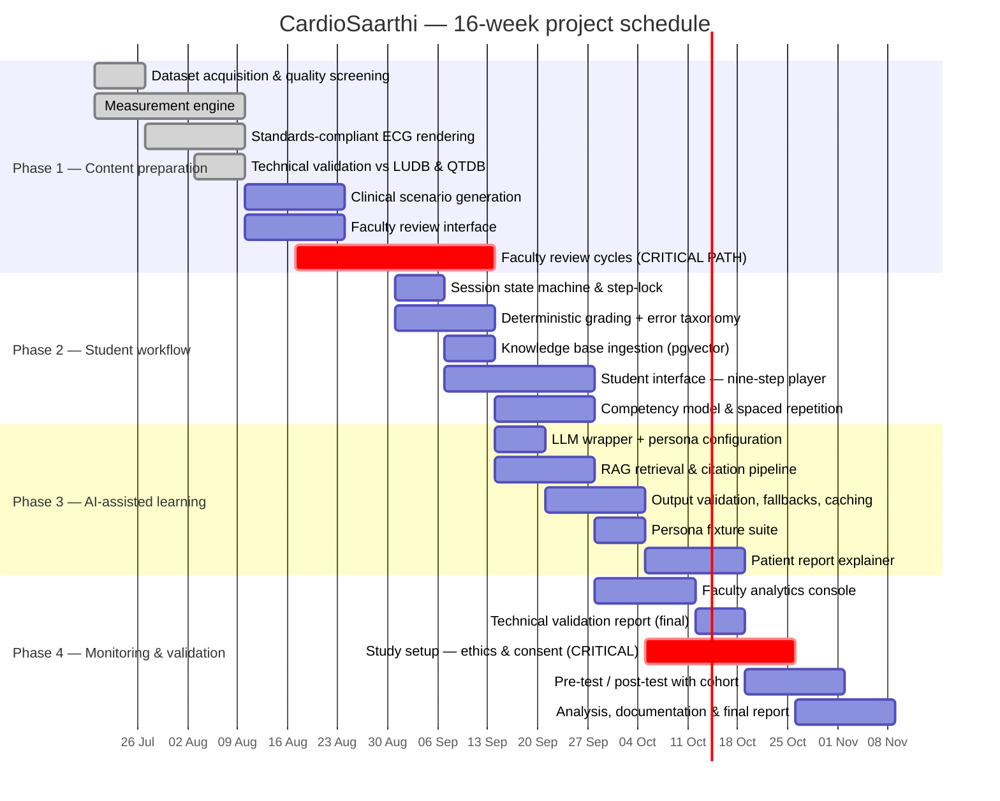

# Project schedule

`gantt.png` / `gantt.pdf` are generated. Do not edit them by hand — edit the task
list in `signal-service/scripts/build_gantt.py` and re-run:

```bash
python signal-service/scripts/build_gantt.py
```

`START_MONDAY` and `TODAY` at the top of that file are the only two dates to change when
the schedule shifts. Everything else is derived, so the "today" line, the completed bars
and the milestone positions can never disagree with each other.

Phase names and colours are taken from the methodology diagram deliberately, so the two
slides read as one system.

## Status as of 9 August 2026 (end of week 3)

| Phase | State |
|---|---|
| 1 — ECG content preparation | Measurement engine, renderer and technical validation **delivered**. Scenario generation and faculty review still to come. |
| 2 — Student learning workflow | Not started (week 7). |
| 3 — AI-assisted learning | Not started (week 9). |
| 4 — Faculty monitoring & validation | Not started (week 11). |

Phase 1 is **four tasks of seven** complete. The engine is done; the case bank is not,
because a case bank is not finished until faculty have approved it.

## The two critical-path items

Neither is a coding task, and that is the point.

1. **Faculty review cycles (weeks 5–8).** The brief names review throughput as the
   critical path, not the code. 385 cases are measured and waiting; the constraint is
   reviewer hours. Book the sessions in advance rather than requesting them as needed.
2. **Study setup — ethics, consent, cohort scheduling (weeks 12–14).** Consent and
   timetabling with a nursing cohort cannot be compressed, and they land in the busiest
   part of the semester. Starting this in week 12 is already late; week 10 would be safer.

## Milestones

| | Week | |
|---|---|---|
| M1 | 3 | Engine validated against LUDB and QTDB — **done** |
| M2 | 4 | First faculty review session |
| M3 | 8 | 60 approved cases in the bank |
| M4 | 10 | Student runtime live end to end |
| M5 | 13 | Layers 3 and 4 complete |
| M6 | 16 | Final submission |

M3 is set at 60 rather than 200 on purpose — the brief's own guidance is to reach 60
approved cases before chasing 200.

## Editable source (Mermaid)

If the chart needs to go into a tool that renders Mermaid, this is the same schedule.
The generated PNG is the presentation copy; this is the fallback.


